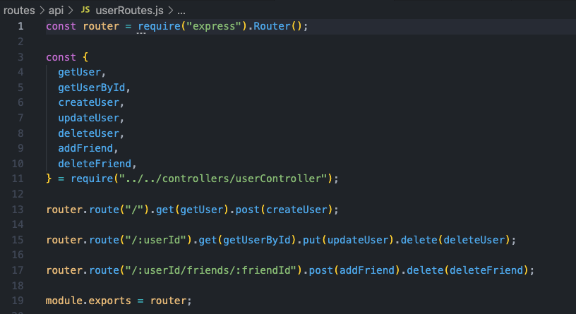
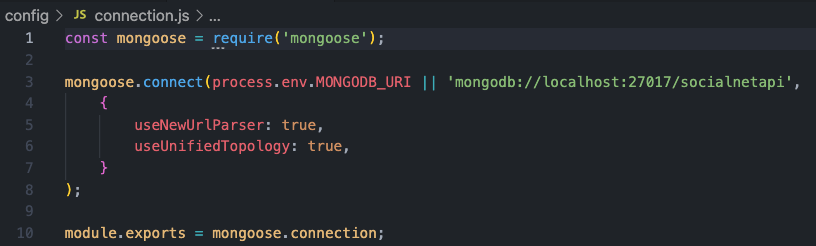

# HW18-Social-Network-API 
 
Deployed walkthrough video: [Tutorial Video](https://youtu.be/ioxL47Ldv5E) 
Application Repository Page: [gitHub Repository](https://github.com/Taylor25et/HW18-Social-Network-API) 
## Description
This backend application uses Express.js, MongoDB, and Mongoose to run an API for a social media website. The API allows users to share their thoughts, react to friends’ thoughts, and create a friend list. 
#### USER STORY
AS A web developer 
I WANT to create a backend database API for a social network using NoSQL,MongoDB and Mongoose 
SO THAT users can easily add, update, or remove profiles, friends, thoughts and reactions.

## Table of Contents

- [Installation](#installation)
- [Usage](#usage)
- [License](#license)
- [Contributing](#contributing)
- [Questions](#questions)

## Installation 
To create this application I installed the Express.js and Mongoose packages. I used Express.js for routing, a MongoDB database, and the Mongoose ODM. After creating my connection.js config I build my Models for users, thoughts, and reactions. After that I created API routes based on the assignment requirements. Lastly I created my controllers to give the application it’s functionality. 

#### See the quicklinks below for each doccument:  
- Config: [connection.js](https://github.com/Taylor25et/HW18-Social-Network-API/blob/main/config/connection.js) 
- Models: [index.js](https://github.com/Taylor25et/HW18-Social-Network-API/blob/main/models/index.js) || [Reaction.js](https://github.com/Taylor25et/HW18-Social-Network-API/blob/main/models/Reaction.js) || [Thought.js](https://github.com/Taylor25et/HW18-Social-Network-API/blob/main/models/Thought.js) || [User.js](https://github.com/Taylor25et/HW18-Social-Network-API/blob/main/models/User.js)
- Controllers: [thoughtController.js](https://github.com/Taylor25et/HW18-Social-Network-API/blob/main/controllers/thoughtController.js) || [userController.js](https://github.com/Taylor25et/HW18-Social-Network-API/blob/main/controllers/userController.js)
- Routes:  [index.js](https://github.com/Taylor25et/HW18-Social-Network-API/blob/main/routes/index.js)
    - API:  [index.js](https://github.com/Taylor25et/HW18-Social-Network-API/blob/main/routes/api/index.js) || [thoughtRoutes.js](https://github.com/Taylor25et/HW18-Social-Network-API/blob/main/routes/api/thoughtRoutes.js) || [userRoutes.js](https://github.com/Taylor25et/HW18-Social-Network-API/blob/main/routes/api/userRoutes.js) 

## Usage
Please see the gif below for a short clip of the opperations in use. For larger viewing capabilities and full tutorial video please visit my [YouTube Tutorial Video.](https://youtu.be/ioxL47Ldv5E)  
#### Delete a User and their thoughts

## License
This project is covered under the MIT license. 

## Contributing
This project would not have been possible without the contributions credited in the links below. 
- [Express Webpage](https://expressjs.com/): Express is a minimal and flexible Node.js web application framework that provides a robust set of features for web and mobile applications.
- [Mongoose ODM v6.3.2](https://mongoosejs.com/): Mongoose provides a straight-forward, schema-based solution to model your application data. It includes built-in type casting, validation, query building, business logic hooks and more, out of the box.
## Questions
Please feel free to contact me with any questions or suggestions either on my GitHub account or via email.
* GitHub: https://github.com/taylor25et
* E-Mail: taylor25et@gmail.com

